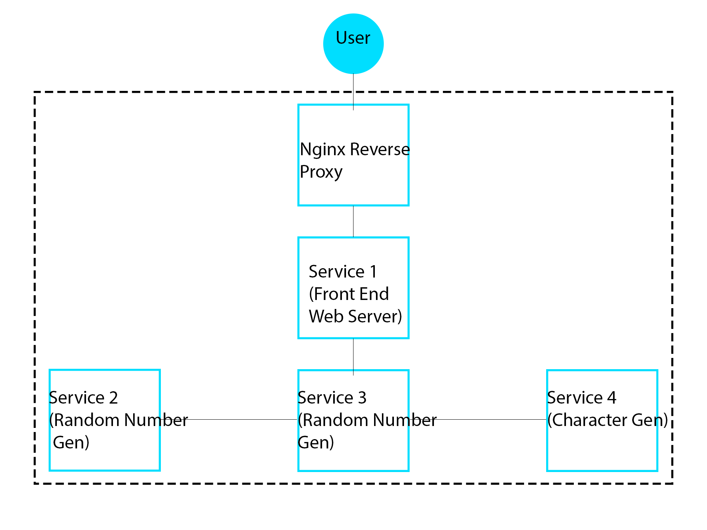
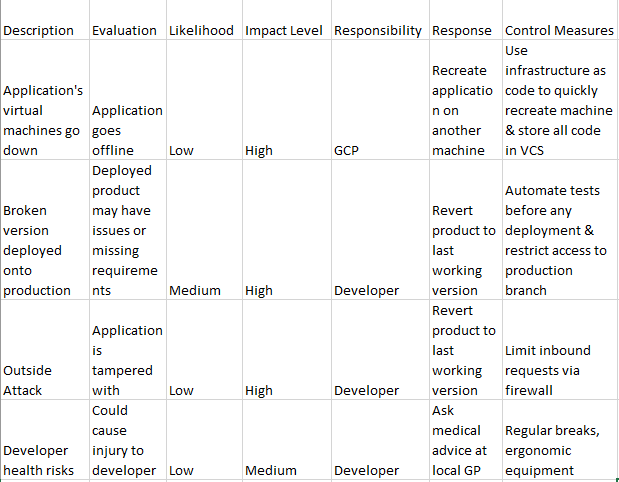

# QA-Assignment-2
I have created a multi-service project that will randomly generate a character you can play in Skyrim. My aim is that this will create a fun way to play the game by randomly selecting a name, race and archetype/class to play as. (As archetype is not an official feature in Skyrim, I will class it as the most preferrable skills to allocate skillpoints to and way in which the game will be played)

## Contents
* [App Design](#App-Design)

## App Design
Because of the requirements that were set in the design brief I had to structure my app in a specific way. This meant containerising 4 services, running them in a Docker swarm, creating builds using Jenkins-pipeline and managing configuration using Ansible.

## CI
Jira Backlog: 
[Jira](https://astarkqa.atlassian.net/jira/software/projects/A2/boards/3/backlog)
Jenkins Pipeline: 

##Risk Assessment

##Testing
Testing the app required unit testing each function in each service. 
I then automated these tests in the Jenkins pipeline before building the images to make sure that any error isn't pushed to the live application.
